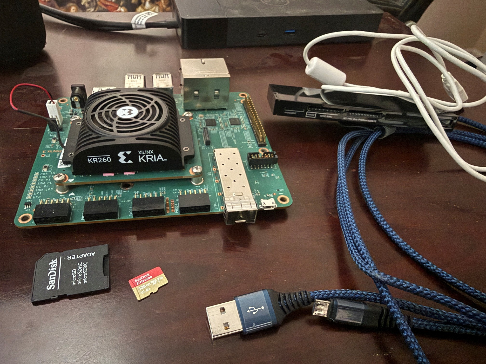
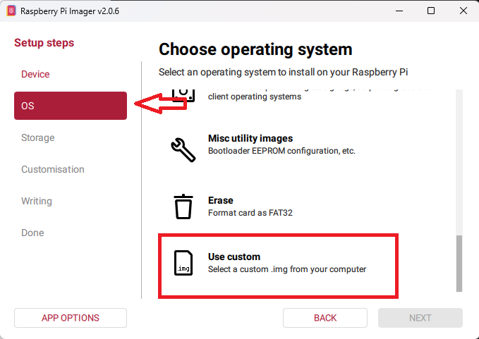
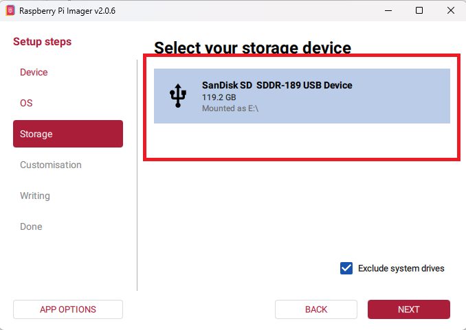
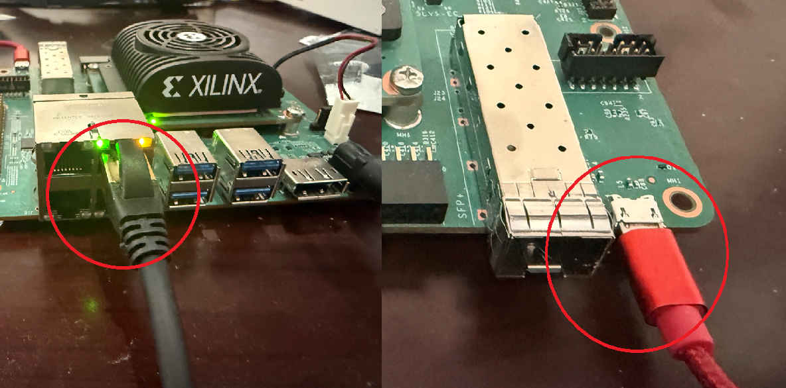
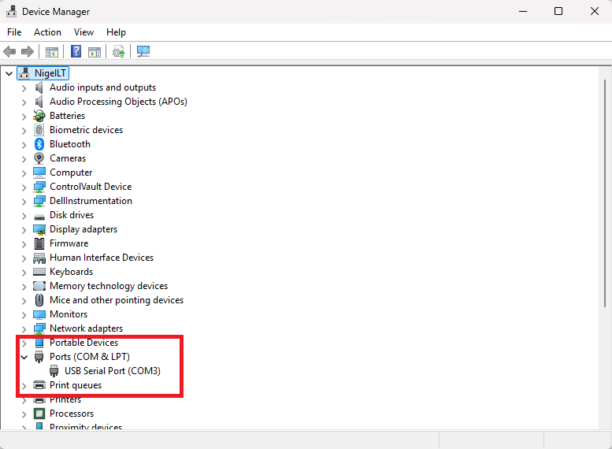
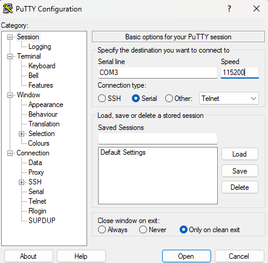

# Intial Setup Of Kria Kr260 Board

**NOTE:** The minimum firmware version for Ubuntu 24.04 is BootFW-01.02 or later. If you need to update your firmware the details are here: [Kria SOM Boot Firmware Update](https://xilinx-wiki.atlassian.net/wiki/spaces/A/pages/3020685316/Kria+SOM+Boot+Firmware+Update#K26-Boot-Firmware-Updates)

If you can't boot Ubuntu 24.04 LTS try the previous version, 22.04 LTS, and upgrade the firmware from that. These instructions should still work with that version.

Things you will need



1. Kria Kr260 Robotics Starter Kit (Comes with power supply)
1. A Micro SD card, minimum size 32 MB, 64 MB preferred. (I used 128 MB so that works too).
1. A USB to Micro USB cable.
1. Some way to plug the Micro SD into you PC to image it.
1. One Ethernet cable and a port to plug it into. The board does not have a WiFi interface.

## Download Image And Write To Card

You can download the image here: [Install Ubuntu On AMD](https://ubuntu.com/download/amd)

When you get to the page choose Kria K26 SOMc under Chose A Board. The download the Ubuntu Server 24.04 LTS image. You can use any image writer you like to image the SD card. I used the Raspberry Pie Imager for Windows.

Open the Raspberry Pie Imager. You're not creating an image for a Raspberry Pie so you won't have to select a device. Instead click on the OS setup step and scroll down to select "Use Custom".



Navigate you folder structure to select the file you have just downloaded. Now you need to select the storage to. Make sure you select the SD card and not a local drive.



Click Next and then Write. It will warn you that you are about to erase all the data on the disk. Once the write is complete you can eject the MicroSD card and move to the Kria.

## The First Boot

Insert the card into the Micro SD slot on the underside of the Kria Board. You will need to insert it with the copper contacts facing up.

Next you will need to connect the ethernet cable to the top right Ethernet port and the USB to Micro USB into the micro USB port.



Now plug the Kria power supply into to the board to power it on.

On first boot we won't know the IP address of the Ethernet port. However, with the USB to MicroUSB cable plugged in, we can access it using serial communications (UART) over an old fashioned COM port with a baud rate of 115200.

Open the Windows Device Manager and find the COM ports. In my case there was only one.



Now you can use your favorite Terminal app to access it over this port. I used PUTTY.



Opening it up you should get a blank terminal. Press the Enter key and you will get the login prompt.

You will initially need to log in with the default credentials

```
User:     ubuntu
Password: ubuntu
```

When you log in it should prompt you to change your password. You should do so. It should do this on the first login but if it doesn't, don't panic. Log in and out a couple of times and eventually it will.

Once you have logged in you can use if config to get the address of the ethernet port.

```
$ ifconfig

eth1: flags=4163<UP,BROADCAST,RUNNING,MULTICAST>  mtu 1500
        inet 192.168.9.38  netmask 255.255.255.0  broadcast 192.168.9.255
        inet6 fe80::9c8f:a328:17bf:d600  prefixlen 64  scopeid 0x20<link>
        ether 00:0a:35:25:8d:ff  txqueuelen 1000  (Ethernet)
        RX packets 93700  bytes 135568363 (135.5 MB)
        RX errors 0  dropped 0  overruns 0  frame 0
        TX packets 21991  bytes 1500969 (1.5 MB)
        TX errors 0  dropped 0 overruns 0  carrier 0  collisions 0
        device interrupt 41

```

On my setup the top right is eth1. Yours may be different. Anyway since there is only one cable plugged in it will be the port with an IP address (assuming there is a DHCP server on your network somewhere). You can use this address to ssh into the device.

Now lets's check the the default app is installed:

```
$ sudo xmutil listapps
Accelerator  Accel_type                    Base    Pid  Base_type  #slots(RPU+PL+AIE)    slot->handle
k24-starter-kits    XRT_FLAT        k24-starter-kits  id_ok    XRT_FLAT             (0+0+0)              -1
k26-starter-kits    XRT_FLAT        k26-starter-kits  id_ok    XRT_FLAT             (0+0+0)           0->0,
```

You can see two apps. The srter kit app for the K-24 and one for the K-26 . Since this is a K-26 board the k26-starter-kits app is in slot 0, meaning it is currently running.

Now we want to check the firmware version:

```
$ sudo xmutil bootfw_status

Image A: Bootable
Image B: Bootable
Requested Boot Image: Image B
Last Booted Image: Image B
XilinxSom_QspiImage-k26-v2.1-06140636
ImageA Revision Info: K26-BootFW-01.02-06140626
ImageB Revision Info: 1-20251115173103
```

## Installing Utilities

Right now there are no compilers or make utilities installed so we will need to set those up. The first step in this process is to update the apt database.

```
$ sudo apt update
```

Now install gcc

```
$ sudo apt-get install -y gcc
```

Next install g++

```
$ sudo apt-get install -y g++
```

Then install make

```
$ sudo apt-get install -y make
```

And then finally we install a pascal compiler, in our case fpc.

**Note**: Delphi has an ARM compiler for windows and a Linux compiler for x86. It does not yet have a Linux compiler for ARM, so we will have to use free pascal at this time.

```
$ sudo apt install -y fpc
```
