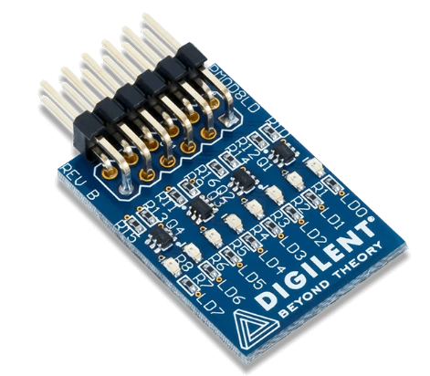
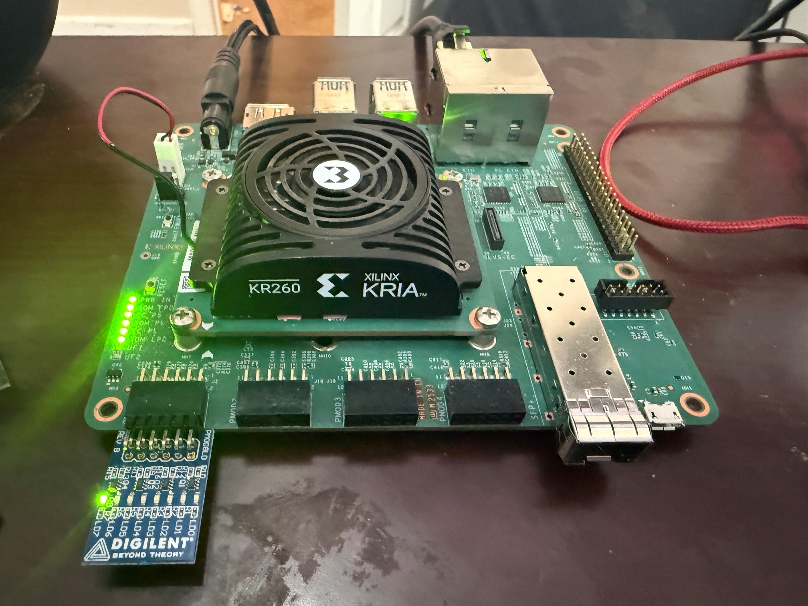

# KriaAxiDma

This is a very basic project to demonstrate working with the KRIA KR260 board.

## dma-proxy-test

A port of the xilinx user space demo app to pascal. Did this so I could use it as a roadmap for accessing DMA from my pascal applications in other projects.

## firmware

The firmware project has three objectives:

1. **Create A Basic AXI Stream FIFO In VHDL (Complete)**. AMD/Xilinx have a an AXI Stream FIFO component as part of the IP that ships with Vivado but I need actual VHDL code that implements a both a slave and a master AXI Stream interface which I can use a s a blueprint for later projects.
1. **Interface With External Hardware**. This is done through the PMOD interfaces. The objective here is to get data on and off the board. In the demo we interact with a Pmod 8 LED peripheral that lights the next LED each time the Axi Stream drives TLAST high.

   

1. **Debug With Internal Logic Analyzer (TBD)**. The ILA can be added to the block design however there is an issue with clocking - even when using the dedicated JTAG port (not the JTAG/UART port). The issue is using the fabric clock (pl_clk0). Need to demonstrate using the external 25 MHz clock (on package pin C3) and a Clocking Wizard.

Test project with extenral hardware.

## read-dma-reg

Application to read and display contents of Xilinx DMA control and status registers for both MM2S and S2MM. Needs to run using sudo.

## xilinx

This is a straight copy of the AMD/Xilinx Proxy DMA driver and the demo user space application. The only changes I have made to the code are using all the of the transfer data arrays (in the user space app), and adding extra logging in the driver to help debugging my own code. The Xilinx code works just fine. I also added makefiles for both projects.
